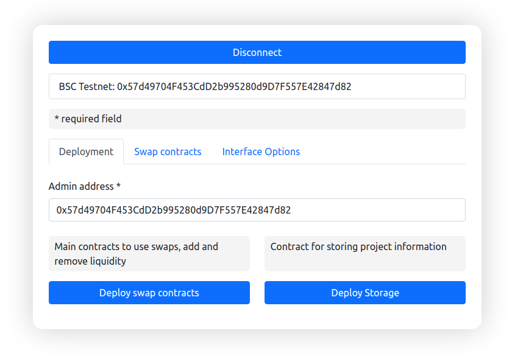

White Label Exchange Solution on top of lead dex uniswap.org . 

# Installation

## Fastest way. 
Click here to run own DEX on random subdomain *.onout.xyz https://randomredirect.i4.workers.dev/

## DNS way. Simple and secured way. Most recommended.
The only one password you need is your domain registar's password, you don't need a server. app.uniswap.org use the same. 

1. Login to your domain provider (where you have registered domain name)
2. Open DNS setting of your domain and add CNAME record `your.domain` - `https://cloudflare-ipfs.com/` (see how to do this in your registar: [GoDaddy](https://www.google.com/search?q=how+to+add+cname+in+godaddy), [Namecheap](https://www.google.com/search?q=how+to+add+cname+in+Namecheap), [Cloudflare](https://www.google.com/search?q=how+to+add+cname+in+Cloudflare)
)
3. TXT record for `_dnslink.your.website` with the value `dnslink=/ipfs/QmUh7FY9391Gya8tW7wK6Haz14n9eompxUQm4QmfDDhH7K`

That't it! Now open your domain and you'll see the installation master! 

### Preview

---

Once you finiish this form the domain will linked to your MetaMask address (your eth address will recorded as "admin" of your domain in the "domainRegistry" smartcontract. TODO: добавить линки на этот реестр в разных сетях).

# Support and updates
Join the channel https://t.me/unifactory_channel
