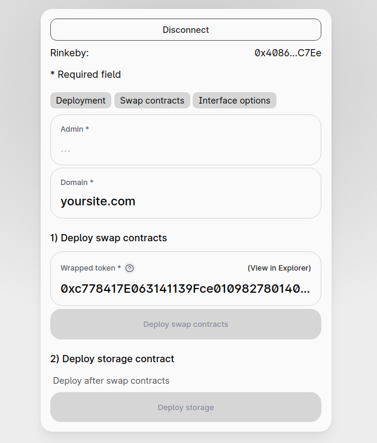
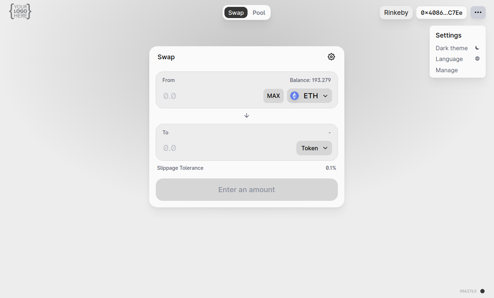

White Label Exchange Solution based on uniswap.org's sources. Set up your commission from 0.05% to 20%. Demo

Admin can create own DEX. Add logo, change colors, use own domain name, add/edit token to tokenlist (main dropdown).

- Deploy smartcontract in 2 clicks
- New DEX will be created without liquidity

# Price

It's free, 20% of your revenue (your fee) will forward to our development fund. We will use this to support the software up to date.

# Can i trust you?

This tool was developed by the team who made MCW wallet ([trusted by 1000+ webmasters](https://codecanyon.net/item/multicurrency-crypto-wallet-and-exchange-widgets-for-wordpress/23532064)). We use uniswap.org sources with small changes, you can check the sources of smartcontract after deployment then compare it with the verified uniswap's contracts. We don't have access to the pools. We do our best to prevent all damages to our users, anywayг use this software at your own risk. Join Our Discord https://discord.gg/Nhgfdkvemz

# Installation

## Fastest way.

Click here to run your own DEX on random subdomain \*.onout.xyz https://randomredirect.i4.workers.dev/

## DNS way. Simple and secured way. Most recommended.

The only password you need is your domain registrar's password, you don't need a server. app.uniswap.org uses the same.

1. Log in to your domain provider (where you have registered domain name)
2. Open DNS settings of your domain and add a **CNAME** record: `your.domain` with the value `https://cloudflare-ipfs.com/` (see how to do this in your registar: [GoDaddy](https://www.google.com/search?q=how+to+add+cname+in+godaddy), [Namecheap](https://www.google.com/search?q=how+to+add+cname+in+Namecheap), [Cloudflare](https://www.google.com/search?q=how+to+add+cname+in+Cloudflare))
3. Add a **TXT** record: `_dnslink.your.domain` with the value `dnslink=/ipfs/Qmf1aoTiLijNwKhJ2cet8neLwq9YQmsooUPsepjh6qSTQY`

That's it! Now open your domain and you'll see the installation master!

---

### Settings

---

### App

---

Once you finish this form the domain will be linked to your MetaMask address (your eth address will be recorded as "admin" of your domain in the "domain registry" smart contract. TODO: добавить линки на этот реестр в разных сетях).

## Are you (evm) blockhcain developer?

Infrastructure is the key element of the blockchain success. Decentralised applications, games, exchanges (DEXs) – that’s what blockchain is started from. Add your network to this file https://github.com/noxonsu/unifactory/blob/main/src/networks.json (send this file as pullrequest or send to t.me/swaponlinebot)

# Join the community

- Channel (news) https://t.me/unifactory_channel
- Join Our Discord https://discord.gg/Nhgfdkvemz
- Subscribe for e-mail updates https://forms.gle/GpenjHAsEW92UFf6A
