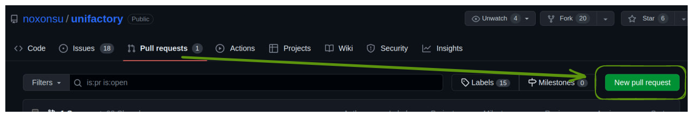
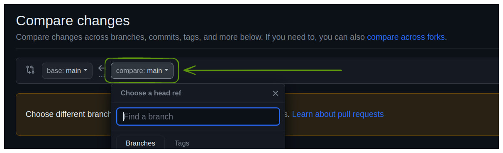

# How to add a new network

> We're usually busy. So if you can test this locally, it would be much faster to add a network. Perform all the basic user and admin actions and attach screenshots to the pool request.

1. Copy this repository:

```bash
git clone https://github.com/noxonsu/unifactory
```

2. Add new content in the end of the file: [networks.json](https://github.com/noxonsu/unifactory/blob/main/src/networks.json). In the source this can be found along the way `src/networks.json`. Content structure:

> At the same time, you can add a test network. Because new networks have to be tested.


```json5
// The key as a chain id
"137": {
  "name": "Polygon",
  "rpc": "https://polygon-rpc.com/",
  "chainId": 137,
  "explorer": "https://polygonscan.com/",
  // Used in the connection modal for the network item border color
  "color": "#8247E5",
  // Aggregates results from multiple contract constant function calls. Addresses for networks are here:
  // https://github.com/mds1/multicall
  "multicall": "0x11ce4B23bD875D7F5C6a31084f55fDe1e9A87507",
  // Netowrk native currency config
  "baseCurrency": {
    "decimals": 18,
    "name": "Matic",
    "symbol": "MATIC"
  },
  // ERC20 token acts as an equivalent for the native currency.
  // It allows us to trade the native currency with ERC20 token
  "wrappedToken": {
    "address": "0x0d500B1d8E8eF31E21C99d1Db9A6444d3ADf1270",
    "name": "Wrapped Matic",
    "symbol": "WMATIC"
  }
},
```

> In the end do not forget to verify `multicall` and `wrappedToken` contracts in the network explorer. If it's not verified yet.

3. Add a network logo in the `src/assets/images/<chain symbol>.png` (**.png** or **.svg** formats). Import a new logo image in `src/assets/images/index.ts` in the same directory.

4. Start locally and test it. Make screenshots along the way.

5. Make a new branch with a new network. In the root of **Unifactory** repository:

```bash
git checkout -b feat/new-network # you can add a network name to avoid any collisions in branches
git add .
git commit -m 'feat: add a new network'
git push origin feat/new-network
```

In Github interface open a new pool request:




